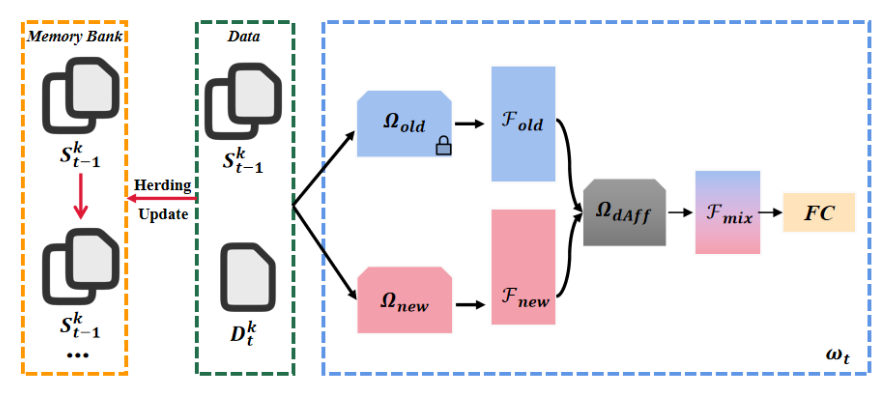

# 1.26 PP-FCIL论文精读

### 联邦类增量学习：动态的联邦学习？

**摘要**：联邦学习（FL）提供了一个协作培训框架，聚合来自分散客户端的模型参数。然而，许多现有模型假设 FLa 内静态的、预定的数据类，这通常是不切实际的假设。**由于灾难性的遗忘，来自客户的实时数据添加可能会降低已建立类别的全局模型识别能力。当以前的参与者不熟悉的新客户零星加入时，这种情况会更加严重。**此外，客户数据隐私也势在必行。为了解决这些问题，我们提出了隐私保护联邦类增量学习（PP-FCIL）方法。这种方法确保了内容级别的隐私，并显着降低了 FCIL 中灾难性遗忘的风险。据我们所知，这是第一项旨在将差异隐私嵌入到 FCIL 设置中的研究。**具体来说，我们引入了一种双模型结构，利用新旧知识的自适应融合来获得新的全局模型。我们还提出了一种多因素动态加权聚合策略，考虑模型的数据不平衡时效性等多个因素，以加快全局模型聚合和准确性。在隐私保护方面，我们利用贝叶斯差分隐私为不同数据集提供更加均衡的隐私保护。**最后，我们在 CIFAR-100 和 ImageNet 上进行了实验，将我们的方法与其他方法进行比较并验证其优越性。

- Q：这篇论文讲了什么？

  - 这篇论文主要研究在联邦学习（FL）中数据类别动态变化和客户端数据隐私保护的挑战
  - 论文提出了一种新的方法：隐私保护的联合增量学习（PP-FCIL）。这种方法结合了双模型结构、贝叶斯差分隐私和多因素动态加权聚合策略
    - 双模型结构有助于平衡新旧知识，减少灾难性遗忘
    - 贝叶斯差分隐私为不同数据集提供平衡的隐私保护
    - 多因素动态加权聚合策略考虑了数据不平衡和模型时效性因素，以增强全局模型聚合和准确性
- Q：什么是增量学习？

  - 增量学习是一种机器学习方法，旨在使模型能够逐渐学习新数据或任务，同时**保留对先前学习的知识的记忆**

  - 与传统的机器学习的区别

    - 增量学习允许模型逐步学习，随着时间推移不断地接收新数据

    - 传统的机器学习通常需要一次性地使用所有可用数据来训练模型，也就是在训练过程开始时，所有的数据都必须准备好并同时使用

  - 它**解决了数据存储的限制，减少了重复训练的需要**，并助力于模型适应新信息而不遗忘旧信息

  - 这种学习方式对于实时更新的应用场景，如在线推荐系统或监控系统等，尤为重要
- Q：什么是联邦类增量学习？

  - 联邦类增量学习（FCIL）的设置中，每个本地客户可以根据自己的偏好不断收集训练数据，而未见过新课程的新客户可以随时加入FL培训
- Q：什么是灾难性遗忘？

  - 灾难性遗忘（CF）是指在原始任务上训练的神经网络在新任务上训练后崩溃并降低其在原始任务上的性能
  - CF的作用是限制神经网络持续学习的能力以及在不断变化的环境中适应新任务同时保留旧任务知识的能力
- Q：何时会发生灾难性遗忘？

  - 当神经网络的权重受到新任务的数据和目标的影响，导致原始任务的知识被破坏或覆盖时，就会发生CF
  - 在实际应用中，一些客户加入FL培训的时机是灵活的，他们可能会引入其他客户看不到的新类别数据。在这种情况下使用现有的FL方法也可能导致CF
- Q：什么是双模型？

  - 双模型结构通常用于处理机器学习中的某些挑战，如在增量学习环境中的知识保存
  - 这种结构中用两个模型来实现特定目标
    - 一个模型可能专注于学习新的数据或类别，而另一个模型则专注于保持对旧数据或类别的知识
  - 在隐私保护的联合增量学习中，双模型结构可能用于同时保护数据隐私和提高学习效率
- Q：双模型的优缺点？

  - 优点：
    - 灵活性和效率：可以针对不同的任务定制不同的模型，增强整体系统的灵活性和效率
    - 减少遗忘：在增量学习中，一个模型可以专注于新数据，另一个保留对旧数据的记忆，减少所谓的“灾难性遗忘”
    - 专业化：每个模型可以专注于特定类型的数据或任务，提高特定领域的性能

  - 缺点：
    - 资源消耗：运行和维护两个模型可能比一个模型更耗费计算资源
    - 复杂性增加：双模型结构增加了系统的复杂性，可能需要更精细的调整和优化
    - 协调难度：确保两个模型有效协同工作可能是一个挑战，特别是在它们需要交换信息或共同作出决策时
- Q：作者怎么保持双模型结构的稳定性？

  - 使用模型压缩来保持双模型结构的稳定性并减少客户端的内存压力
- Q：作者怎么使用双模型结构的？
- 双模型策略包括两个特征提取器，即 old 和 new ，以及双模型自适应特征融合模块 dAff 
  - 在客户端 k 的第 t 轮，冻结之前在第 t-1 轮训练的模型，以保留现有信息
- 再引入一个可训练的网络 new ，它具有一致的架构来学习新知识

- Q：贝叶斯差分隐私和拉普拉斯差分隐私的区别？（==可考虑使用贝叶斯差分隐私==）

  - 贝叶斯差分隐私：这种方法通常涉及使用贝叶斯统计技术来估计数据集的隐私损失。它可以提供一种更灵活的隐私保护机制，允许根据数据的特定特性或上下文调整隐私保护级别。这种方法可能更适用于复杂的数据分析场景。

  - 拉普拉斯差分隐私：这是一种更传统的差分隐私方法，通过向数据添加拉普拉斯噪声来保护隐私。这种方法相对简单，易于实施，通常用于提供固定级别的隐私保护。它适用于需要固定隐私保障水平的标准化场景。
  - 贝叶斯差分隐私在某些方面可能更灵活和适应性强，但实现起来可能更复杂；拉普拉斯差分隐私在实现上更直接、简单，但可能不如贝叶斯方法在特定情况下灵活
  - 基于DP的学习算法的现有工作包括本地DP（LDP）、基于DP的分布式SGD、DP元学习
- Q：作者为何要使用贝叶斯差分隐私？
  - 更灵活，可根据数据分布修正噪声强度，为不同数据集提供更均衡的隐私保护
- Q：作者是如何使用贝叶斯差分隐私的？
  - 贝叶斯差分隐私的关键特点是基于客户本地数据分布来添加噪声，使噪声添加更加合理
  - 论文提出了一种本地贝叶斯隐私保护方案，利用BDP的原理和高级组合定理来监控客户在FCIL中的隐私损失
    - 隐私损失是一个衡量差分隐私中个人隐私泄露风险的指标
    - 在差分隐私的上下文中，隐私损失表示当给定数据集中的单个数据项发生变化时，输出（如查询结果或模型预测）分布的变化程度
  - 具体实施步骤包括：
    1. 计算每次迭代的隐私成本：利用数据分布μ(x)和高级组合定理监测联合增量学习（FCIL）中客户的隐私损失
    2. 子采样的高斯噪声机制：用于FCIL的隐私保护，计算输出分布 p(ω(t)ω(t−1) D′)
    3. 根据贝叶斯差分隐私的原理：确定每次迭代的隐私成本，累计整个学习过程的隐私成本
       - 每当执行一次数据处理或查询操作，都会消耗一部分隐私预算，这部分消耗就是隐私成本
    4. 确保整个学习过程的隐私成本不超过预定的隐私预算：保证学习过程中隐私成本的累积不超出设定的隐私预算
       - ε>0为隐私预算，可以表示隐私保护的程度，其越小，隐私保护越好，但加入的噪声越多，数据可用性下降

  - 通过对模型参数引入噪声，攻击者无法通过查询模型获得精确的输出结果，从而防止他们恢复训练数据或根据输出结果推断特定样本是否属于模型的训练数据
